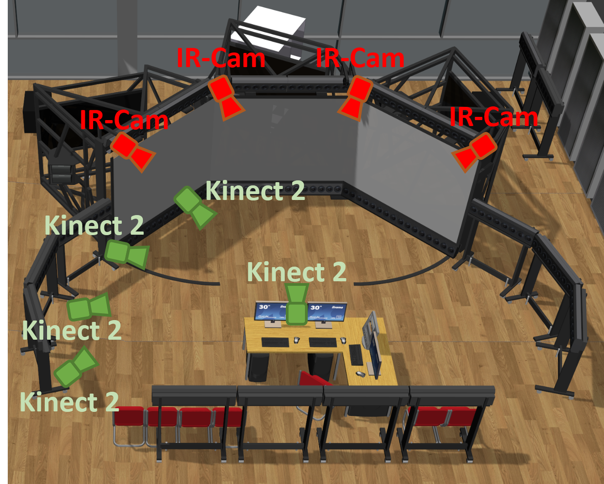
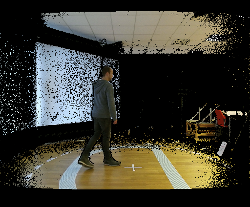
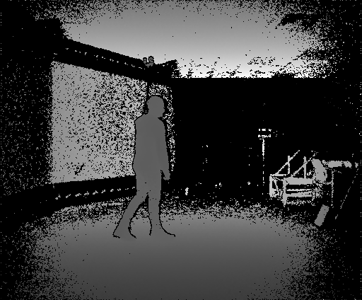
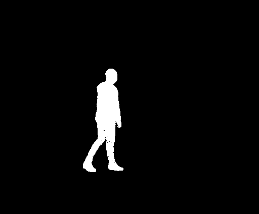
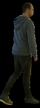
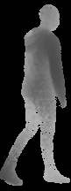
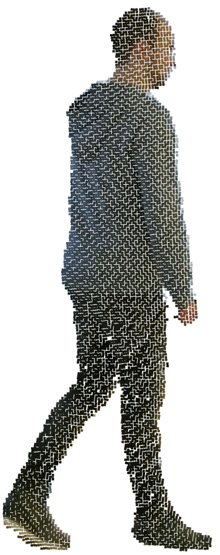
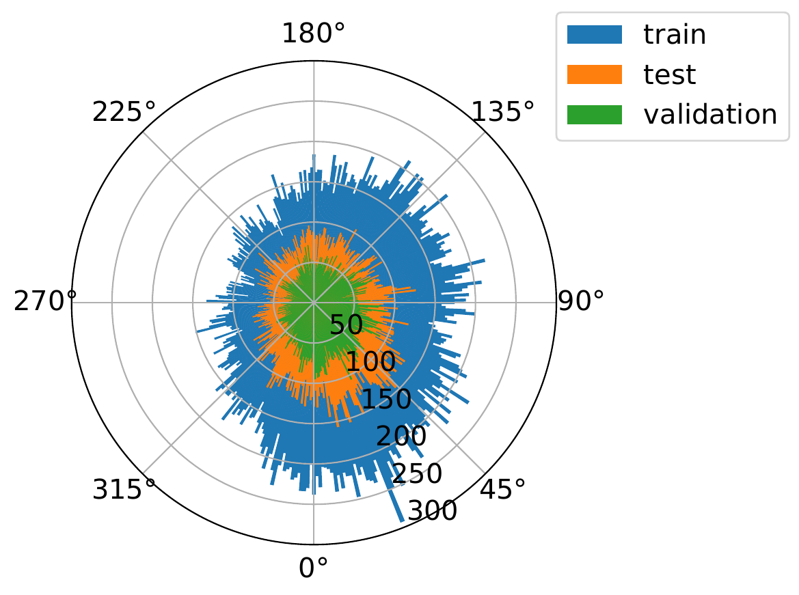

# NICR RGB-D Orientation Data Set

The [NICR RGB-D Orientation Data Set](https://www.tu-ilmenau.de/neurob/data-sets-code/rgb-d-orientation/)
is a data set for upper body orientation estimation of humans with continous 
ground truth labels for the angle perpendicular to the ground. Each data sample 
was recorded with a Kinect2 device and thus, consists of a (depth aligned) RGB 
and depth image 
as well as of detailed label information. Furthermore, we already converted 
the persons in both images into pcd-files which represent colored point clouds. 
These clouds 
can be opened with the [Point Cloud Library](http://pointclouds.org/). Each of 
the 37 persons within the data set was tracked by an external 
[ARTTRACK tracking system](https://ar-tracking.com/) in order to generate 
precise ground truth labels. In total, the data set consists of more than 
100,000 samples divided into training, validation and test.

## Recording Setup and Recorded Data
The data set was captured in the lab for 
[virtual reality at our university](https://www.tu-ilmenau.de/kvr/technische-ausstattung/). 
For recording, we used multiple synchronized Kinect2 sensors simultaneously 
and all persons were tracked with the external 
[ARTTRACK tracking system](https://ar-tracking.com/) which consists of a 
tracking device and four infrared cameras. The lab and the used sensors are 
pictured in the image below.
<figure style="text-align: center;">
    
    <figcaption>Recording setup with five Kinect2 sensors and the external IR cameras for
    tracking.</figcaption>
</figure>
Before recording, we learned a depth background model in the absence 
of any human for each Kinect2. During the record, we then used this model to 
compute mask images of the persons as shown in the image below. For each sample, 
the mask image as well as the (depth aligned) color and depth images are part 
of the data set. 

    
Color and depth image of one sample in the data set as well as 
the extracted mask image. All three types of images are part of the 
data set.

With the mask image it is possible to extract depth and color patches for each 
sample. Furthermore, we also converted the depth and color images 
into a colored point cloud of the persons. The images below show the resulting 
data. Note: The extracted patches are not part of the data set, but they can be 
easily created with the mask images (see [Usage](#usage)).

    
Color and depth patch as well as the colored point cloud of 
one sample. While the point cloud is part of the data set, the patches 
need to be extracted with the color, depth and mask images.

The final data set contains the color, depth and mask images of the persons as 
well as two colored point clouds, one in full resolution and one filtered with a 
6cm voxel grid filter, which approximately corresponds to the point density of a 
point cloud in a distance of 10 meters in front of a Kinect2. Additionally, 
there is a json file for each frame which contains among other things the upper 
body orienation angle in degree, the gender of the subject, the mean distance 
to the recording sensor and the encasing bounding boxes we used for patch 
extraction 
in our work. In order to be able to convert the images to point clouds by 
yourself, the data set also contains the intrinsic parameters for each Kinect2 
sensor.

## Data distribution
In total the [NICR RGB-D Orientation Data Set](https://www.tu-ilmenau.de/neurob/data-sets-code/rgb-d-orientation/) 
contains 108,505 data samples of 37 persons from which 22 are male and 15 are 
female. It is split into training, validation and test subsets as follows: 

| data set | male persons | female persons | samples |
|:--------:|:------------:|:--------------:|:-------:|
| training | 14 | 7 | 57717 |
| validation | 4 | 3 | 19368 |
| test | 4 | 5 | 31420 |

Since we did not want to have the same person in different subsets we split 
the data by person and not by the number of samples! The angular distribution 
of all subsets is shown in the image below.

<figure style="text-align: center;">
    
    <figcaption>Angular distribution of training, validation and 
    test sets.</figcaption>
</figure>

## File Structure
There is a directory for each subset of data, i.e. a directory for training, 
validation and test. In each of these are the following directories:
- *json*: Contains json files with label information for each person sample, 
including among other things ground truth angle annotation in degree, gender of the 
subject, average distance to the sensor, encasing bounding box and the 
approximate height of the person
- *small*: Contains the depth, color and mask images for each person as 
pgm and png files respectively
- *small_patches* (Does not exist by default): Contains the 
depth and color patches (created with the extraction script - see 
[Usage](#usage) section)
- *pcd*: Contains the colored point cloud in full resolution for each person 
sample as pcd files from the [Point Cloud Library](http://pointclouds.org/)
- *pcd_downsampled*: Contains the colored point cloud for each person filtered 
with a 6cm voxel grid filter (corresponds approximately to the point density of 
a point cloud in a distance of 10 meters in front of a Kinect2 sensor) as pcd 
files from the [Point Cloud Library](http://pointclouds.org/)

Each of these subdirectories contains a directory for each person of that subset
which holds the actual data.

## Get access to the NICR RGB-D Orientation Data Set
Visit the [NICR RGB-D Orientation Data Set](https://www.tu-ilmenau.de/neurob/data-sets-code/rgb-d-orientation/) web page.

## Source Code License and Citations
The source code in this package is published under BSD 3-Clause 
license, see [license file](LICENSE) for details. NOTE: This license only 
covers the source code in this package, NOT the actual data set! 
Extra Terms and Conditions apply to the data set, which must be aggreed to! See 
[Get access section](#get-access-to-the-nicr-rgb-d-orientation-data-set) and 
the 
[NICR RGB-D Orientation Data Set](https://www.tu-ilmenau.de/neurob/data-sets-code/rgb-d-orientation/)
web page.

If you use our data set in your work, please cite the following paper:
>Benjamin Lewandowski, Daniel Seichter, Tim Wengefeld, Lennard Pfennig, 
Helge Drumm and Horst-Michael Gross
*Deep Orientation: Fast and Robust Upper Body Orientation Estimation for Mobile 
Robotic Applications.*
To be published in: 
IEEE International Conference on Intelligent Robots and Systems (IROS) 2019

```bibtex
@InProceedings{doe2019
  Title = {{Deep Orientation: Fast and Robust Upper Body Orientation Estimation for Mobile Robotic Applications}},
  Author = {Lewandowski, Benjamin and Seichter, Daniel and Wengefeld, Tim and Pfennig, Lennard and Drumm, Helge and Gross, Horst-Michael},
  Booktitle = {To be published in: IEEE International Conference on Intelligent Robots and Systems (IROS)},
  Year = {2019}
}
```
In any publication that uses the NICR RGB-D Orientation Data Set 
(including online publications and Web sites), it is only permitted to represent 
the persons p0, p1, p8, p11 and p12 in images and illustrations. 
The illustration of all the other persons is strictly prohibited.

## Usage

1. Download and extract data set files
2. Install dependencies and python package (Python >= 3.6)
    ```bash
    # clone repository
    git clone https://github.com/tui-nicr/nicr-rgb-d-orientation-data-set.git
    
    # option 1: install OpenCV 3 separately (optional) and data set package 
    pip install opencv-python==3.4.2.* [--user]
    pip install /path/to/this/repository [--user]

    # option 2: install data set package including OpenCV 3
    pip install /path/to/this/repository[with_opencv] [--user]
    ```
3. Use data set (examples)
    ```python
    from nicr_rgb_d_orientation_data_set import load_set
    import matplotlib.pyplot as plt
 
    # load set, e.g. training set
    data_set = load_set('/path/to/downloaded/data/set', set_name='training')

    # extract all patches at once
    data_set.extract_all_patches()
 
    # load depth, rgb and mask patch of a single sample, e.g. the 11th sample
    sample = data_set[10]
    depth_patch = sample.get_depth_patch()
    rgb_patch = sample.get_rgb_patch()
    mask_patch = sample.get_mask_patch()
   
    # visualize sample
    fig = plt.figure()
    ax = fig.add_subplot(1, 3, 1)
    ax.imshow(depth_patch, cmap='gray')
    ax.axis('off')
    ax = fig.add_subplot(1, 3, 2)
    ax.imshow(rgb_patch)
    ax.axis('off')
    ax = fig.add_subplot(1, 3, 3)
    ax.imshow(mask_patch, cmap='binary_r')
    ax.axis('off')
    fig.suptitle(f'Angle: {sample.orientation}°')
    fig.show()
    ```
    For further examples, see [Deep Orientation Repository](https://github.com/tui-nicr/deep-orientation.git).
